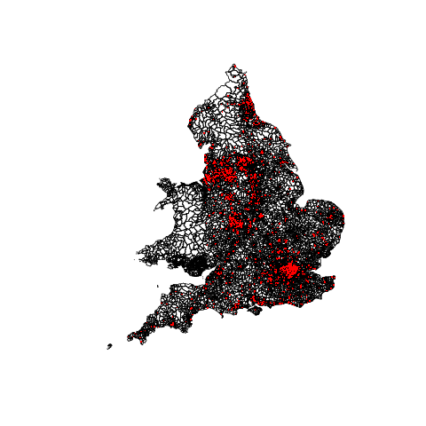
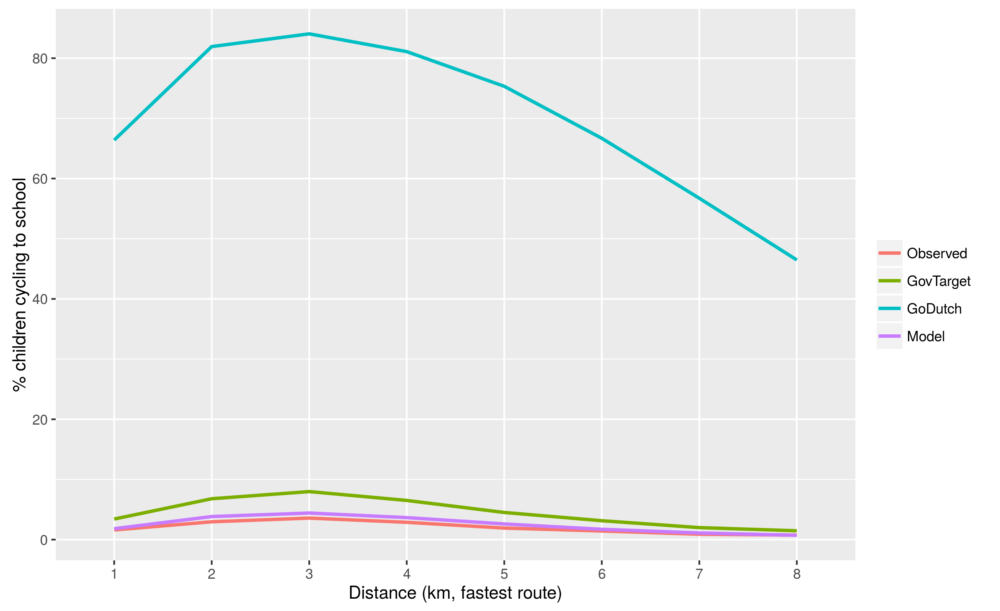
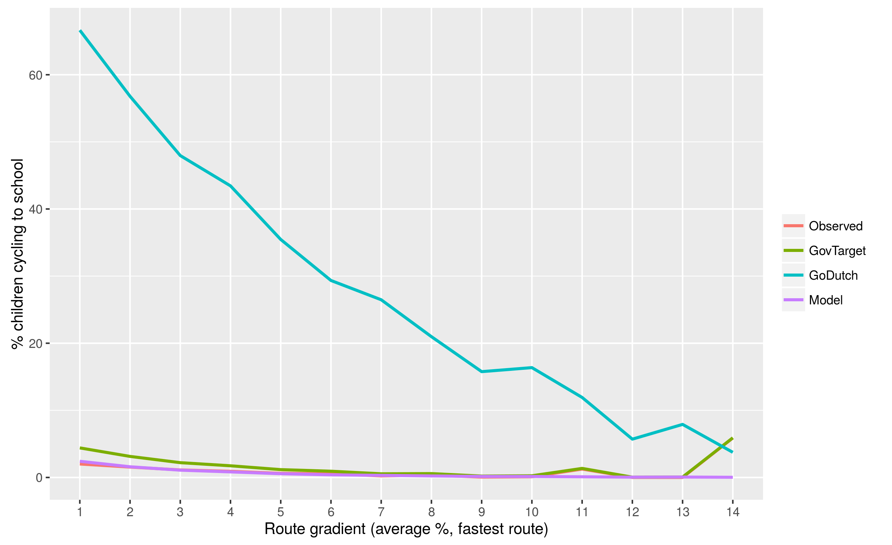
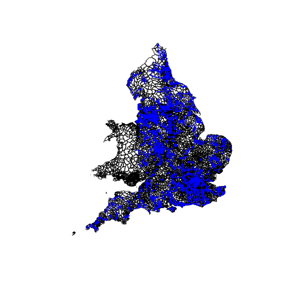

```{r, include=FALSE}
knitr::opts_knit$set(root.dir = "..")
knitr::opts_chunk$set(echo = FALSE)
```

## Context (see the ['CWIS' report](https://www.gov.uk/government/publications/cycling-and-walking-investment-strategy))


## The propensity to cycle tool | Source: Lovelace et al. ([2017](https://www.jtlu.org/index.php/jtlu/article/view/862))

```{r}
knitr::include_graphics("../../pct/flow-model/od-scens-leeds.png")
```

## The problem


## The solution (Author's [photo](https://www.flickr.com/photos/97888609@N02/35266243966/in/album-72157684966127236/) in Enter, NL)


```{r setup, include=FALSE}
# Run from RStudio when the project pctSchoolsUK.Rproj is open
run_code = FALSE # should the code run?
if (file.exists("private_data/s11.Rds")) {
  if (run_code) {
    source("R/exploratory_analysis.R")
    source("R/all_England.R")
  }
}
```

```{r, echo=FALSE}
bib = httr::GET("https://www.zotero.org/api/groups/418217/collections/RZSVFK8G/items/top?limit=100&format=bibtex&v=1", httr::write_disk("paper/refs.bib", overwrite = T))
knitr::opts_chunk$set(warning=FALSE, message=FALSE, out.extra = "")
if(!run_code) {
  knitr::opts_chunk$set(eval = FALSE, warning=FALSE, message=FALSE)
}
```

## Previous findings from literature

- Increased levels of physical activity can improve student learning [@shephard_required_1984;@sallis_effects_1999]
- Cycling can account for around half of school commutes in cycling friendly cities [@bere_longitudinal_2011]
- Strong evidence that segregated infrastructure along major school commute corridors can boost local cycling rates [@boarnet_evaluation_2005;@mcdonald_impact_2014]
- In the US $\sim 40\%$ of students walked or cycled to school in 1969, $\sim 13\%$ by 2001 [@mcdonald_active_2007]
- In the UK walking to school dropped $\sim 20\%$ points in a similar period (1970 to 1991) [@tudor-locke_active_2012]
- UK baseline: 46\% of 5-10 year-olds and 38\% of 11-16 year-olds walking
    - Walking dominates under 1 mile, car/bus 2+ miles [@department_for_transport_national_2014]
    
## School commuting and health

- Regular exercise has multiple, mutually reinforcing benefits
- US child/youth obesity rates have reached 17\% [@fryar_prevalence_2012;@karnik_childhood_2012]
- 10–30% obesity rates in the EU [@ben-sefer_childhood_2009]
- 60 minutes of daily moderate to vigorous physical activity recommended [@janssen_systematic_2010;@strong_evidence_2005]
- Part of the NHS Physical Activity Guidelines for Children and Young People [@n.h.s._physical_2016]
- But (maybe people here know of more studies) *more research needed*

## Input data

```{r filteringtable, echo=FALSE, eval=TRUE}
df_input = readr::read_csv(
'"Filtering","Level","N. rows","N. columns","Example var (num)","Mean"
Pre,School,17183,179,"Headcount Pupils",316
Post,School,1534,179,"Headcount Pupils",951
Pre,"OD pair",908034,10,"Total Flow",8.3
Post,"OD pair",154593,10,"Total Flow",9.4
'
)
knitr::kable(df_input, caption = "Summary of input datasets provided by the Department for Education, before and after filtering for Secondary schools only.")
```

```{r , echo=FALSE, include=FALSE}
ifelse(!dir.exists(file.path("paper", "figures")), dir.create(file.path("paper", "figures")), FALSE)
if(!file.exists("paper/figures/schoolsEngland.png")){
  png(file = "paper/figures/schoolsEngland.png")
  plot(las); points(schools, col="red", pch='.', cex=2)
  dev.off()
}
```

## Distribution of schools

```{r schoollocations, echo=FALSE, out.width="49%", fig.show='hold', fig.cap="The distribution of all Secondary-level schools with at least 100 pupils in England", fig.align='center', eval=TRUE}

```

## Comparison of cycling to work and cycling to school

```{r, echo=FALSE, include=FALSE}
if(!file.exists("paper/figures/pcycle_schools.png") | !file.exists("paper/figures/pcycle_work.png")){
  pcycle_schools = qtm(lads_active, fill = "Cycle")
  save_tmap(pcycle_schools, "paper/figures/pcycle_schools.png")
  #system("gs -sDEVICE=pdfwrite -dCompatibilityLevel=1.4 -dPDFSETTINGS=/screen -dNOPAUSE -dQUIET -dBATCH -sOutputFile=paper/figures/pcycle_schools_reduced.pdf paper/figures/pcycle_schools.pdf")

  pcycle_work = qtm(lad_pcycle, fill = "pcycle")
  save_tmap(pcycle_work, "paper/figures/pcycle_work.png")
  
  #plot(schoolvswork$Cycle, schoolvswork$pcycle, xlab="Cycling commutes to school (%)", ylab="Cycling commutes to work (%)")
}
```

```{r pcycleschools, echo=FALSE, out.width="49%", fig.show='hold', fig.cap="The observed cycling prevalence fractions for school commutes, and for work commutes (the latter were obtained from the 2011 Census).", fig.align='center', eval=TRUE}
knitr::include_graphics(c("figures/pcycle_schools.png", "figures/pcycle_work.png"))
```

## Walking and cycling results

```{r activeChor, echo=FALSE, out.width="49%", fig.show='hold', fig.cap="Choropleth showing the prevalence of walking (left) and cycling (right) as a fraction of total commuting for school commutes in England.", fig.align='center', eval=TRUE}
knitr::include_graphics("figures/active_choropleth.png")
```

## Modelling

$$
P(y_i = 1) = \mathrm{logit}^{-1} \left( \beta_1 d_i + \beta_2 d_i^{1/2} + \beta_3 d_i^2 + \beta_4 g_i + \beta_5 d_i g_i \right)
$$

## Model fit for UK data (distance)

```{r modeldistance, echo=FALSE, out.width="49%", fig.show='hold', fig.cap="The modelled vs observed cycling percentages, as a function of distance.", fig.align='center', eval=TRUE}
knitr::include_graphics(c("figures/data_model_distance.png", "figures/data_model_scatter_distance.png"))
```

## Model fit for UK data (gradient)

```{r modelgradient, echo=FALSE, out.width="49%", fig.show='hold', fig.cap="The modelled vs observed cycling percentages, as a function of gradient.", fig.align='center', eval=TRUE}
knitr::include_graphics(c("figures/data_model_gradient.png", "figures/data_model_scatter_gradient.png"))
```

## Uptake Scenarios (distance)

```{r uptakedistanceplot, echo=FALSE, out.width="49%", fig.show='hold', fig.cap="The cycling percentages observed, modelled, and projected under the Government Target and Go Dutch scenarios, as a function of distance.", fig.align='center', eval=TRUE}

```

## Uptake Scenarios (gradient)

```{r uptakegradientplot, echo=FALSE, out.width="49%", fig.show='hold', fig.cap="The cycling percentages observed, modelled, and projected under the Government Target and Go Dutch scenarios, as a function of gradient.", fig.align='center', eval=TRUE}

```

## Headline figures

- For trips < 15km (90%+ school commutes), the current percentage of children cycling to school in England is 2.7%.

- Scenarios show the scale of transformation possible in school travel patterns: 'Going Dutch' would see over two-thirds of these children cycle to school, approaching the level observed in The Netherlands.

- Higher than the 27% cycle mode share in an equivalent 'Go Dutch' scenario for cycling to work

## Desire line level results

```{r flowsEngland, echo=FALSE, out.width="49%", fig.show='hold', fig.cap="The desire-line level school commuting flows between LSOA centroids and Secondary schools in England.", fig.align='center', eval=TRUE}

```

## Route network level results


## Discussion

- Add primary schools
- Estimate environmental/economic benefits?
- System boundaries

## What about 'cycle passenger' as a mode? | Source: Author's photo, Munster. Thanks Mark Padgham and Ezra!


## Key References and questions

- Abstract: https://icth.confex.com/icth/2017/schedule/papers/index.cgi?username=1989&password=741756

- Lovelace, Robin, Anna Goodman, Rachel Aldred, Nikolai Berkoff, Ali Abbas, and James Woodcock. “The Propensity to Cycle Tool: An Open Source Online System for Sustainable Transport Planning.” Journal of Transport and Land Use 10, no. 1 (January 1, 2017). doi:10.5198/jtlu.2016.862.

- Singleton, Alex. “A GIS Approach to Modelling CO2 Emissions Associated with the Pupil-School Commute.” International Journal of Geographical Information Science 28, no. 2 (November 2014): 256–273. doi:10.1080/13658816.2013.832765.

- Contact
  - r.lovelace @ leeds.ac .uk
  - [`@robinlovelace`](https://twitter.com/robinlovelace)


## References {.smaller}

