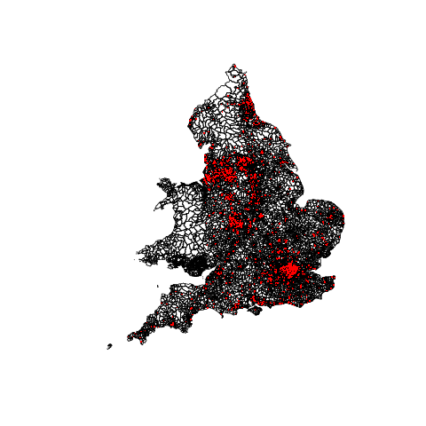
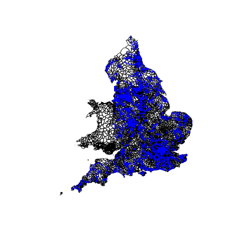
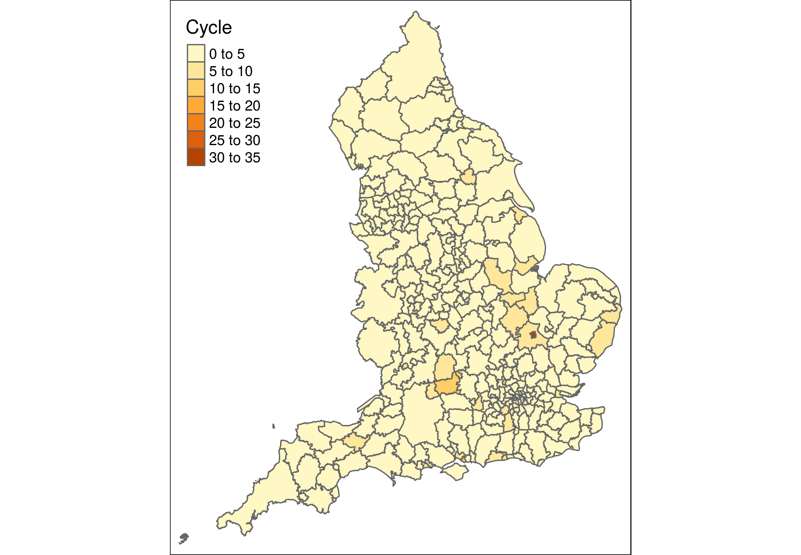
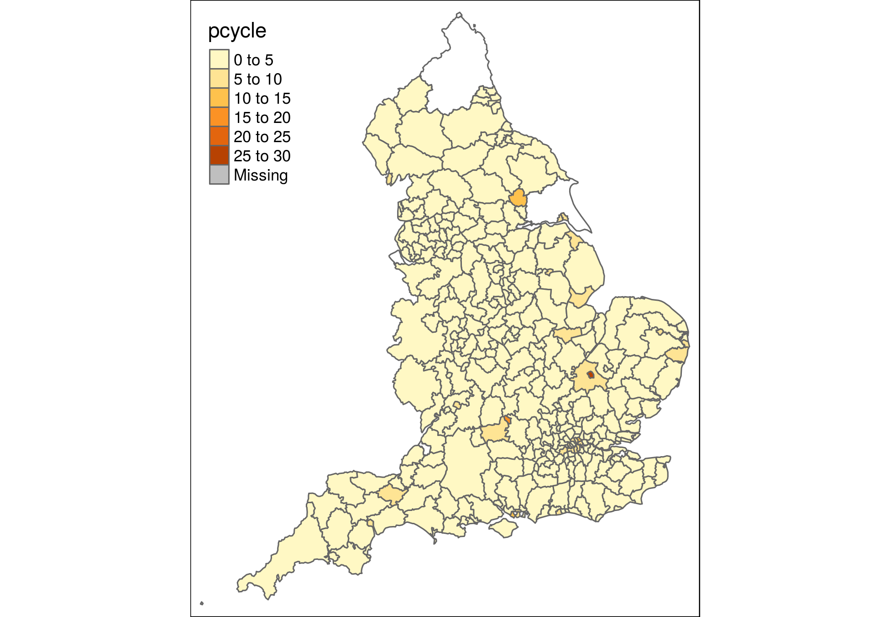
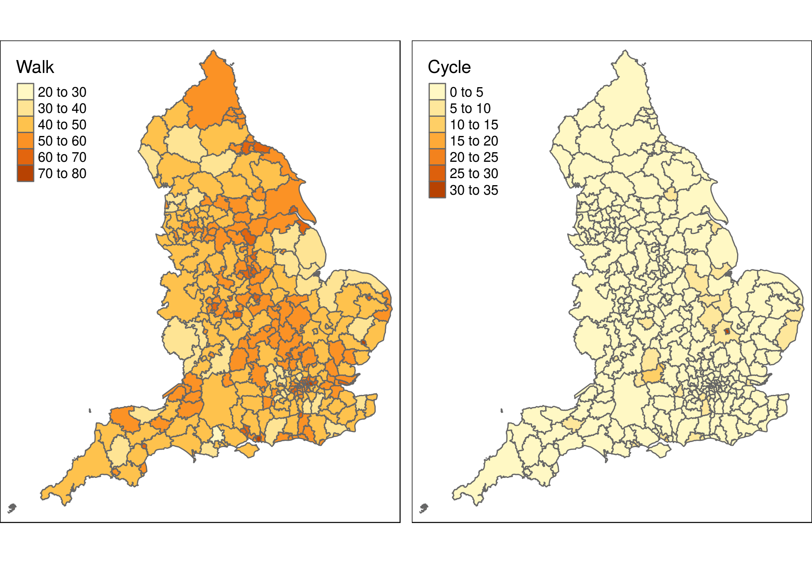

```{r, include=FALSE}
knitr::opts_knit$set(root.dir = "..")
```


```{r setup, include=FALSE}
# Run from RStudio when the project pctSchoolsUK.Rproj is open
if(file.exists("private_data/s11.Rds")) {
#if(file.exists("DONTRUNprivate_data/s11.Rds")) {
  run_code = TRUE
  source("R/exploratory_analysis.R")
  source("R/all_England.R")
} else {
  run_code = FALSE
}  
```

```{r, echo=FALSE}
bib = httr::GET("https://www.zotero.org/api/groups/418217/collections/RZSVFK8G/items/top?limit=100&format=bibtex&v=1", httr::write_disk("paper/refs.bib", overwrite = T))
knitr::opts_chunk$set(warning=FALSE, message=FALSE, out.extra = "")
if(!run_code) {
  knitr::opts_chunk$set(eval = FALSE, warning=FALSE, message=FALSE)
}
```

<!-- # Planning (temporary section for ideas etc - also use GH issues) -->

<!-- - Target journal: Journal of Transport and Health (JTH): [journals.elsevier.com](http://www.journals.elsevier.com/journal-of-transport-and-health) -->
<!-- - Author [guidelines](https://www.elsevier.com/journals/journal-of-transport-and-health/2214-1405?generatepdf=true): -->
<!--     - "Divide your article into clearly defined and numbered sections" -->
    

# Introduction

Active travel to school offers many benefits across a range of policy objectives. From a public health perspective it contributes to the physical and mental wellbeing of new generations [@oja_health_2011]. Active travel to school also has environmental benefits, in the form of reduced motorised traffic, improved air quality and reduced greenhouse gas emissions [@singleton_gis_2014]. 
<!-- A knock-on health co-benefit reduced levels of danger of road traffic casualties resulting from the reduction in road traffic. -->
From an education perspective, physical and mental barriers to educational success can be reduced by physical activity, and there is evidence to suggest that increased levels of physical activity can improve student learning [@shephard_required_1984, @sallis_effects_1999].

In terms of health, regular exercise has multiple, mutually reinforcing benefits^[There are of course risks that come with cycling, which likely vary with the level of training and cycling proficiency [@teyhan_impact_2016, @tetali_road_2016], however we will not discuss those here.]. Over the space of a lifetime habitual physical activity reduces the risk of common causes of death, including heart disease and diabetes. In addition to mitigating health risks, the benefits of regular physical activity also include increased aerobic capacity, muscle and bone strength, flexibility, insulin sensitivity, and healthier blood lipid profiles; as well as reduced stress, anxiety, and depression. Heart health in particular benefits from exercise, and the benefits of active transport (e.g. walking or cycling) to school on heart health have been specifically studied before [@pate_promoting_2006, @sleap_are_1993]. In a more general context, the impact of childhood obesity intervention programmes (including increased physical activity) on health as measured by blood lipid levels has also been studied and found to be positive [@cai_effect_2014]. The impact of regular physical activity on pupils' mental health is harder to quantitatively ascertain, though studies in this direction give tentative indications pointing to a positive impact as well [@biddle_physical_2011, @ahn_meta-analysis_2011]. These health benefits are possibly further enhanced by an observed correlation between active transport to school and overall higher levels of physical activity [@cooper_commuting_2003, @cooper_physical_2005], if such a correlation proved to be causal.

A further additional positive effect of increasing rates of active transport to school is the beneficial environmental impact of reduced motorised traffic. In this context @singleton_gis_2014 investigated the $CO_2$ emissions associated with school commutes, finding that school commutes make a sizeable contribution to $CO_2$ emissions, and uncovering various interesting patterns in carbon emissions in England by region, geodemographic classification, school level, and commute distance.

The primary impact however is perhaps on the physical and mental health of the pupils. Across the industrialised world child and youth obesity rates have been on the rise in recent decades, with the USA reaching obesity rates amongst children and youths of 17\% in recent years [@fryar_prevalence_2012, @karnik_childhood_2012], and Europe reaching similar crisis levels of 10–30% obesity rates in children and 25% in youths [@ben-sefer_childhood_2009]. This childhood obesity problem has now by and large been acknowledged as an epidemic, one which is at present difficult to treat (though interventions have had some measured successes, see for example [@flodmark_interventions_2006]), and which in consequence will likely only increase in the coming years [@reilly_childhood_2007].

Interventions and policies aimed at combating childhood and youth obesity generally focus on dietary education and restrictions, as well as the promotion of increased levels of physical activity. A standard recommendation of 60 minutes of daily moderate to vigorous physical activity can be found in reviews of the literature [@janssen_systematic_2010, @strong_evidence_2005] and is part of the NHS Physical Activity Guidelines for Children and Young People [@n.h.s._physical_2016]. In spite of this and the widespread existence of periodic Physical Education classes in schools, obesity levels remain high and are likely still rising.

 
<!-- Canadian children for example fall very short of this guideline [@colley_physical_2011] (Physical Activity of Canadian Children, Colley; Physical activity of Canadian children and youth: accelerometer results from the 2007 to 2009 Canadian Health Measures Survey. -->
It is in this context that a daily regime of active commuting to and from school could prove to be hugely beneficial both to pupils, and to education and public health outcomes, and one in which there is huge potential for improvement and development, both internationally and in the UK.

<!-- the percentage of children and youths actively commuting to school when the travel distance is $\leqslant 1 \mathrm{mile}$ has been found to be $< 20\%$ for the state of Georgia [@centers_for_disease_control_and_prevention_cdc_school_2002], and as low as $5 \%$ for Columbia, South Carolina [@sirard_prevalence_2005] -->
<!-- The average commute to school for Primary school children takes 13 minutes and covers 1.6 miles, whereas for Secondary school children it takes 25 minutes and covers 3.4 miles. -->


As a point of reference in terms of development in active transport to school, in the US in 1969 $\sim 40\%$ of students walked or cycled to school, a figure which had dropped to $\sim 13\%$ by 2001 [@mcdonald_active_2007]. In the UK by comparison the percentage of pupils walking to school dropped $\sim 20\%$ in a similar period (1970 to 1991) [@tudor-locke_active_2012]. However despite this drop, the UK still has a much higher baseline of pupils actively commuting to school than the US, with 46\% of 5-10 year-olds and 38\% of 11-16 year-olds walking to school, and walking being the dominant form of transport for commutes under 1 mile, and car and bus being dominant for trips of 2 miles or more [@department_for_transport_national_2014].  At the Secondary school level the percentage of students walking has remained fairly stable over the last few years, however at the Primary level the percentage of children walking has decreased, and the percentage of those being driven to school has correspondingly increased.

Active commuting to school in the UK is therefore --unlike in the US and other industrialised countries-- already an established habit for a significant fraction of families, with the potential for significant further increases, to the benefit of the communities and the health of students. This is particularly important in the face of the growing childhood obesity crisis, and the decreasing trend in children walking to school at the Primary level in the UK which represents a regression to less active modes of transport and risks exacerbating the childhood obesity problem. Public health policies and transport infrastructure planning to reverse this trend is therefore absolutely essential to mitigate risks to newer generations in the coming years.

In this work we begin to explore the potential of geographic and spatial data analysis as a guiding principle for evidence-driven public policies and infrastructure development. The long term aim is to make active transport to school an even more dominant mode of transport, and a feasible part of the solution to the childhood and youth obesity epidemic in the UK, with England as a case study.

More specifically the purpose of this paper is twofold: to develop and demonstrate methods for assessing the potential uptake of active travel modes for the school commute, and to apply these methods to England to estimate the potential for modal shift to cycling at the national level^[There is evidence that the commuting distance is perhaps the primary concern in the decision for mode of transport in the school commute [@murtagh_determinants_2016], a problem which evidence-based correctly placed and adequate cycling paths planned could help ameliorate.]. Based on plausible scenarios for change and evidence of the benefits of physical activity for children and reduced road congestion, it would be possible to quantify the benefits of cycling uptake at high geographical resolution, building on these methods. This next stage is beyond the scope of the present work, however: in this paper the focus is on the geographical distribution of cycling and cycling potential, and the methods needed to model modal shift in the school commute. 

# Material and methods

The data source for this paper was the 2011 School Census. This is an annual data source, but the Pupil Usual Mode of Travel was last provided in 2011.^[The
decision to remove this field from the School Census came as a surprise to many working in the transport an health field at the time, as explained on the
[School Travel Health Check website](http://www.sthc.co.uk/SchoolCensus.aspx) [@school_travel_health_check_removal_2012]:
"On the 29th July 2011 the Department for Education announced in the pages of issue no. 50 of the Information about children, education and schools (ICES) e-bulletin that they had unilaterally decided to remove the Pupil Usual Mode of Travel data field from the national school census with immediate effect. This was much to the surprise of ourselves and other providers of data analysis services, not to mention all other government departments, local authorities and schools who were reliant on the data for many of their own strategic planning and operational purposes."
]
Information on the phase of education (e.g. Primary, Secondary, etc.) was obtained from a Freedom of Information request made by someone unrelated to this work, fulfilled by the Department for Education, and [made available online](https://www.whatdotheyknow.com/request/list_of_all_schools_in_england_w).

After selecting only the schools deemed Secondary schools, and considering only schools with at least 100 pupils, the number of relevant schools (and their corresponding commuting flows data set) is reduced as shown in table \@ref("fig:filteringtable").

```{r filteringtable, echo=FALSE}
df_input = readr::read_csv(
'"Filtering","Level","N. rows","N. columns","Example var (num)","Mean"
Pre,School,17183,179,"Headcount Pupils",316
Post,School,1534,179,"Headcount Pupils",951
Pre,"OD pair",908034,10,"Total Flow",8.3
Post,"OD pair",154593,10,"Total Flow",9.4
'
)
knitr::kable(df_input, caption = "Summary of input datasets provided by the Department for Education, before and after filtering for Secondary schools only.")
```

<!-- Top schools by cycling to school percentage -->

<!-- ```{r, echo=FALSE} -->
<!-- temp = res_active -->
<!-- temp[1:10, "Cycle"] = scales::percent(temp[1:10, ]$Cycle/100) -->
<!-- temp[1:10, "Walk"] = scales::percent(temp[1:10, ]$Walk/100) -->
<!-- knitr::kable(temp[1:10,]) -->
<!-- ``` -->


The map in figure \@ref(fig:schoollocations) shows the distribution of Secondary schools along with the LSOA boundaries, and the school commuting flows (with at least 10 commuters) from LSOA centroids to the Secondary schools.

```{r , echo=FALSE, include=FALSE}
ifelse(!dir.exists(file.path("paper", "figures")), dir.create(file.path("paper", "figures")), FALSE)
if(!file.exists("paper/figures/schools_england.png")){
  png(file = "paper/figures/schools_england.png")
  plot(las); points(schools, col="red", pch='.', cex=2)
  dev.off()
}
```


<!--     -->

```{r schoollocations, echo=FALSE, out.width="49%", fig.show='hold', fig.cap="The distribution of all Secondary-level schools with at least 100 pupils in England", fig.align='center'}

```

Comparison of cycling to work and cycling to school.

```{r, echo=FALSE, include=FALSE}
if(!file.exists("paper/figures/pcycle_schools.png") | !file.exists("paper/figures/pcycle_work.png")){
  pcycle_schools = qtm(lads_active, fill = "Cycle")
  save_tmap(pcycle_schools, "paper/figures/pcycle_schools.png")
  #system("gs -sDEVICE=pdfwrite -dCompatibilityLevel=1.4 -dPDFSETTINGS=/screen -dNOPAUSE -dQUIET -dBATCH -sOutputFile=paper/figures/pcycle_schools_reduced.pdf paper/figures/pcycle_schools.pdf")

  pcycle_work = qtm(lad_pcycle, fill = "pcycle")
  save_tmap(pcycle_work, "paper/figures/pcycle_work.png")
  
  #plot(schoolvswork$Cycle, schoolvswork$pcycle, xlab="Cycling commutes to school (%)", ylab="Cycling commutes to work (%)")
}
```
<!--    -->

```{r, echo=FALSE, out.width="49%", fig.show='hold', fig.cap="The observed cycling prevalence fractions for school commutes, and for work commutes (the latter were obtained from the 2011 Census).", fig.align='center'}
knitr::include_graphics(c("figures/pcycle_schools.png", "figures/pcycle_work.png"))
```


# Results

## Area-level results

The choropleth below shows cycling prevalence across Local Authorities in England

```{r, echo=FALSE, include=FALSE}
#qtm(lads_active, fill = c("Walk", "Cycle"), free.scales.fill=FALSE)
if(!file.exists("paper/figures/active_choropleth.png")){
  #pdf(file="paper/figures/active_choropleth.pdf")
  #qtm(lads_active, fill = c("Walk", "Cycle"))
  #dev.off()
  active_choropleth = qtm(lads_active, fill = c("Walk", "Cycle"))
  save_tmap(active_choropleth, "paper/figures/active_choropleth.png")
}
```
<!-- -->
```{r, echo=FALSE, out.width="49%", fig.show='hold', fig.cap="Choropleth showing the prevalence of walking (left) and cycling (right) as a fraction of total commuting for school commutes in England.", fig.align='center'}

```


The table below shows the top 10 Local Authorities by active transport prevalence.
```{r, echo=FALSE}
temp = res_active_la_name
temp[1:10, "Cycle"] = scales::percent(temp[1:10, ]$Cycle/100)
temp[1:10, "Walk"] = scales::percent(temp[1:10, ]$Walk/100)
knitr::kable(temp[1:10,])
```

The table below shows the bottom 10 Local Authorities by active transport prevalence.
```{r, echo=FALSE}
temp = res_active_la_name %>% arrange(Cycle,Walk) #%>% head(n=10)
temp$Cycle = as.numeric(temp$Cycle)
temp$Walk = as.numeric(temp$Walk)
temp[1:10, "Cycle"] = scales::percent(temp[1:10, ]$Cycle/100)
temp[1:10, "Walk"] = scales::percent(temp[1:10, ]$Walk/100)
knitr::kable(temp[1:10,])
#knitr::kable(res_active_la_name %>% arrange(desc(-Cycle,-Walk)) %>% head(n=10))
```


## Modelling

Following the model fitting and uptake scenario modelling in [@lovelace_propensity_2016], we have fit an (elastic net) regularised logistic regression model to the school commuting data, obtaining the fits shown in (FIGURES), with a model and regression coefficients as follows

$$
P(y_i = 1) = \mathrm{logit}^{-1} \left( \beta_1 d_i +\beta_2 d_i^{1/2} + \beta_3 d_i^2 + \beta_4 g_i + \beta_5 d_i g_i + \beta_6 d_i^{1/2} g_i + \beta_7 d_i^{1/3} + \beta_8 q_i \right)
$$
with the $L_1$ and $L_2$ regularisation terms equally weighted and included in the optimisation, and where $y_i$ is a binary-valued response equal to 1 when the pupil performed his/her school commute by cycling, $d_i$ is the route length in kilometres, $g_i$ is the gradient of the route measured in (UNITS), and $q_i$ is the quietness diversion factor (the ratio of the length of the quiet route divided by the length of the fast route).

This model provides a baseline probability for cycling for a given route distance and gradient, as shown in the figures below

```{r, echo=FALSE, fig.cap="The fraction of commuting pupils choosing to cycle to school, as a function of the commute distance (via the fastest route network-level path) and the gradient of the path.", fig.align='center', out.width="49%", fig.show='hold'}
#par(mfrow=c(1,2))
ggplot(traindf@data, aes(x=distance_fast)) + geom_smooth(aes(y=pcycle, col="red")) + geom_smooth(aes(y=pcycle_pred))
ggplot(traindf@data, aes(x=gradient_fast)) + geom_smooth(aes(y=pcycle, col="red")) + geom_smooth(aes(y=pcycle_pred))
```

The model fit along with the data points are shown below

```{r, echo=FALSE, fig.cap="The modelling fit to cycling prevalence, as a function of the fastest route network-level commute distance and the gradient of the path.", fig.align='center', out.width="49%", fig.show='hold'}
#par(mfrow=c(1,2))
ggplot(traindf@data, aes(x=distance_fast)) + geom_point(aes(y=pcycle)) + geom_smooth(aes(y=pcycle, col="red")) + geom_smooth(aes(y=pcycle_pred))
ggplot(traindf@data, aes(x=gradient_fast)) + geom_point(aes(y=pcycle)) + geom_smooth(aes(y=pcycle, col="red")) + geom_smooth(aes(y=pcycle_pred))
```


<!-- Frank Harrell discourages residual plots for logistic regression(!!). So I have omitted this part for now. -->
<!-- https://stats.stackexchange.com/questions/45050/diagnostics-for-logistic-regression/70583#70583 -->

<!-- The residuals of the model fit (SEE FIGURE BELOW) show that at low distances and gradients the model is missing further covariates to account for a significant fraction of the variance, with the covariates included becoming dominant and the model arguably performing well at high distance and high gradient -->

<!-- ```{r, echo=FALSE, fig.cap="The model residuals as a function of the fastest route network-level commute distance and the gradient of the path.", fig.align='center'} -->
<!-- ggplot(residuals, aes(x=Predicted, y=Residual)) + geom_point() + geom_hline(yintercept = 0, col="red")  -->
<!-- ``` -->

<!-- The large, asymmetric and heteroscedastic residuals at low distances and gradients are however not a source of concern as we do not seek high accuracy individual-level predictions accounting for as much variance as possible without overfitting, but rather a model of baseline cycling probabilities for the dominant traits of potential route network-level paths. For this purpose the model fit is appropriate and sufficient. -->


### Uptake Scenarios

We modelled two potential uptake scenarios: the UK Government Target of doubling the number of cycling 'stages' (parts of trips made by bicycle) by 2025, and the Go Dutch scenario, based on levels of cycling to school by distance observed in the Dutch travel survey (OViN).

Incorporating these two scenarios into the logistic regression model, the following uptake distance (and gradient) decay curves can be obtained

```{r, echo=FALSE, fig.cap="The fraction of commuting pupils choosing to cycle to school observed, the model fit to the data, and the Government Target and Go Dutch scenario projections, as a function of the fastest route network commute distance and the gradient of the path.", fig.align='center', out.width="49%", fig.show='hold'}
#par(mfrow=c(1,2))
ggplot(meltggplotdistdf, aes(x=Distance, y=value, color=variable)) + geom_smooth()
ggplot(meltggplotgraddf, aes(x=Gradient, y=value, color=variable)) + geom_smooth()
#ggplot(meltggplotdistdf, aes(distance, pcycle)) + geom_point(alpha=0.5, size=1, shape=21, na.rm = T) + geom_smooth(na.rm = T) + xlim(0,15000)
```


## School-level results

## Desire-line level results

The desire-line level school commuting flows between LSOAs and Secondary schools in England is shown in the figure \@ref("fig:flows_england").

```{r flows_england, echo=FALSE, include=FALSE}
if(!file.exists("paper/figures/flows_england.png")){
  png(file = "paper/figures/flows_england.png")
  plot(las); lines(flow, col = 'blue')
  dev.off()
}
```

```{r, echo=FALSE, out.width="49%", fig.show='hold', fig.cap="The desire-line level school commuting flows between LSOA centroids and Secondary schools in England.", fig.align='center', fig.lp="flows_england"}

```


<!-- ```{r, echo=FALSE, fig.cap="Illustration of the current level of cycling to school at the desire line levels in two case study cities (left: Bradford, right:Cambridge).", include=FALSE, eval=FALSE} -->
<!-- par(mfrow=c(1,2)) -->
<!-- plot(las_brad); lines(flow_brad, pch='.', col="blue", cex=5); points(schools_brad, pch='.', col="red", cex=5) -->
<!-- plot(las_cam); lines(flow_cam, pch='.', col="blue", cex=5); points(schools_cam, pch='.', col="red", cex=5) -->
<!-- par(mfrow=c(1,1)) -->
<!-- ``` -->


## Potential for cycling to school at the route network level


<!-- ```{r, echo=FALSE, include=FALSE} -->
<!-- if(!file.exists("paper/figures/routes_leeds.png")){ -->
<!--   png(file = "paper/figures/routes_leeds.png") -->
<!--   plot(las_leeds); plot(flow_leeds, col="blue", add=T); plot(fast_routes_leeds, col="red", add = T); plot(quiet_routes_leeds, col="green", add = T) -->
<!--   dev.off() -->
<!--   } -->
<!-- ``` -->
<!--  -->

Using the [Cyclestreets](https://www.cyclestreets.net) API, for each origin-destination pair we have retrieved the quiet and fastest route network-level paths between all the relevant LSOA centroids and Secondary schools.

```{r, echo=FALSE, fig.cap="The distribution of path lengths (in metres) along the quiet and the fastest route network-level alternatives for the school commutes in the data. The mean is shown with a blue diamond, and the corresponding box plot is shown as well, with outliers displayed as red circles.", fig.align='center', message=FALSE, out.width="49%"}
ggplot(violindf, aes(Type, Length)) + geom_violin(trim=T, fill="blue", alpha=0.4) + geom_boxplot(width=0.1, outlier.size = 2, outlier.color = "red", outlier.shape = 21) + stat_summary(fun.y=mean, geom="point", shape=18, color="blue", size=3)
```

The most illuminating finding of our research from a policy perspective is at the road network level. Estimates of the number of students who could cycle to school along specific road segments can help planners decide where to invest in new cycle paths that are designed with children in mind.


# Discussion

This paper has provided the first analysis of the potential for modal shift to cycling for secondary school children in England at the desire line level. Building on [@singleton_gis_2014] we find that there is great potential for environmental benefits of this shift. However, the greatest benefits of cycling uptake for the school commute are likely to be health related: for the school children, for the people who breath air along school commute corridors (which will be less congested as a result of the shift away from cars) and for future generations who will benefit from lower driving rates, in terms of air pollution, road safety and more liveable streets.

TODO summarise results here. E.g. how many students currently are driven 5 miles or less? I think we need route distances for this.

A substantial development that we have implemented is mode-specific routing algorithms for all of the desire lines covered in the study area. These reveal that the average trip distance of travel to school, were xx and xx km for the 'fastest' and 'quietest' routes generated by CycleStreets.net respectively. This implies a 'quietness divergeance factor' (QDF) of around xx, slightly more than the average QDF of commute trips from data generated by the Propensity to Cycle Tool (PCT) [@lovelace_propensity_2016].
This is substantially further than the Euclidean average distance of xx km, but shorter than the average fastest driving route of xx km. 
Reductions in the QDF through interventions such as building dedicated off-road cycle paths could greatly increase the attractiveness and safety levels of cycling to school for children and adults alike.

Paragraph saying something about directions for further research.


Paragraph on how this links to policy - e.g. accessibility, expenditure on buses vs cycle paths to school and educational results probably being a bigger benefit than the cost of implementing these things.

<!-- Despite the strength of evidence of the benefits of active travel to school, it has been experiencing a long-term downward trend since at least the 1950s.  -->
<!-- (Active Transportation to School: Trends Among U.S. Schoolchildren, 1969–2001, McDonald)  -->
<!-- (Active Commuting to School: An Overlooked Source of Childrens’ Physical Activity?)  -->
<!-- In the US: [@davison_childrens_2008] -->

<!-- Walking to school correlates with overall greater physical activity at other times as well, for male pupils (Commuting to school: Are children who walk more physically active?, Cooper)  -->

<!-- This trend has continued into the 21^st^ Between 1993 and 2003, for example, the proportion of primary school children being driven to school increased from 29% to 41% while the proportion walking and cycling dropped [@cooper_physical_2005]. -->


References {#references .unnumbered}
==========

